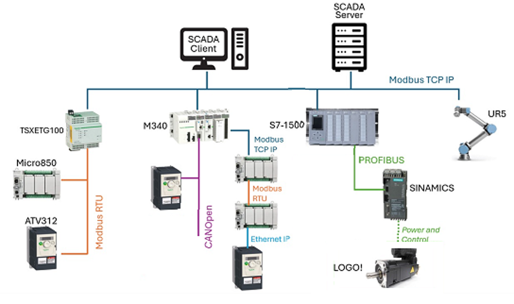

# Beer-Bottling-Plant-Advanced-Automation-System

## Overview
This project simulates an industrial beer bottling plant using a distributed
automation architecture. The system was designed to integrate multiple PLCs,
drives, a robotic arm, and a SCADA system using different industrial
communication protocols.

The project focuses on system integration, control architecture, and
industrial networking rather than purely on control algorithms.

## System Architecture

### Main Components
- Master PLC: Schneider Electric M340
- Secondary PLC: Allen-Bradley Micro850
- -Secondary PLC: S7-1500
- SCADA: Citect SCADA
- Variable Frequency Drives (VFDs)

- Industrial Gateway
- Robotic Arm (command-based control)

## Communication Architecture
| Device | Protocol |
|------|---------|
| M340 ↔ SCADA | TCP/IP |
| M340 ↔ Gateway | Modbus RTU |
| Gateway ↔ Micro850 | Modbus RTU |
| M340 ↔ VFD | CANopen |
| M340 ↔ Robot Arm | TCP/IP (command-based) |

Detailed explanation in `docs/communication_protocols.md`.

## PLC Control Logic
The M340 acts as the master controller and is responsible for:
- Process sequencing of the bottling line
- Coordination between PLCs, drives, and robot
- Communication management across protocols
- Sending execution commands to the robotic arm

> PLC source file available in `plc/m340_master_controller.zef`

## SCADA System
The SCADA system emulates field sensors and actuators and provides:
- Real-time plant visualization
- Alarm management
- Trend visualization
- Operator control interface

Screenshots are available in `/scada/screenshots`.

## Team Contribution (Team of 4)
This project was developed collaboratively, with all team members actively
involved in understanding the full system and learning across disciplines.

My primary contributions were in **PLC programming and system integration**,
working closely with another teammate on control logic and industrial
communications. Specifically, I contributed to:
- PLC programming on the Schneider M340
- Configuration and testing of Modbus RTU and CANopen communications
- Integration between PLC, SCADA, drives, and field devices
- System testing, troubleshooting, and validation

The rest of the team focused mainly on mechanical process simulation and SCADA
visualization, with continuous knowledge sharing across the group.

## Notes
- Sensors and actuators were emulated in SCADA.
- This project was developed for academic purposes.
- Proprietary software files are provided for reference only.
